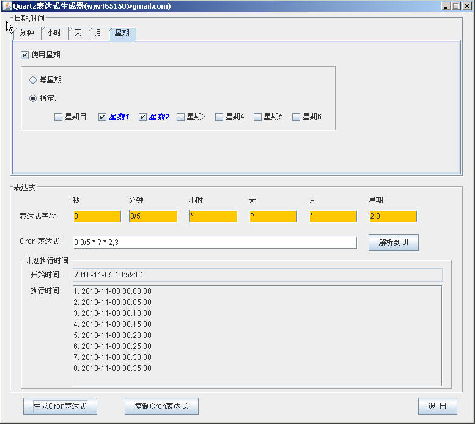

###CronExpBuilder
******
[Quartz](http://quartz-scheduler.org/) 的Cron任务调度表达式一般人很难理解,在Googole上查询也没有发现类似的代码,
所以开发了一个对Quartz Cron 表达式的可视化双向解析和生成的一个java的GUI程序,供使用Quartz的程序员参考和使用.
******
> **执行方式:**
> `java -jar ./CronExpBuilder.jar`

******
**软件截图:**
